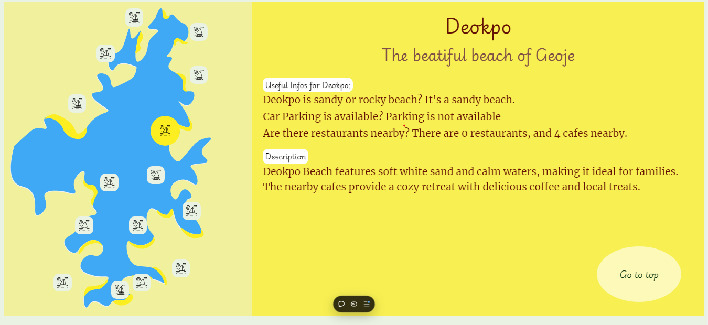
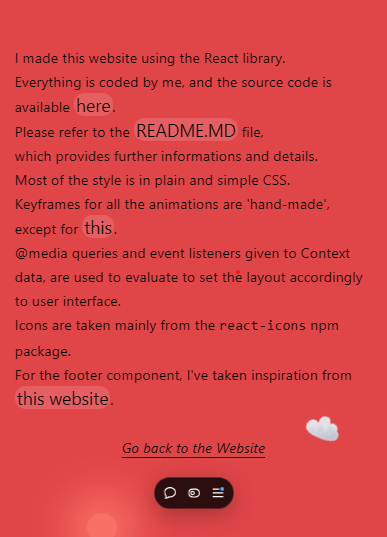
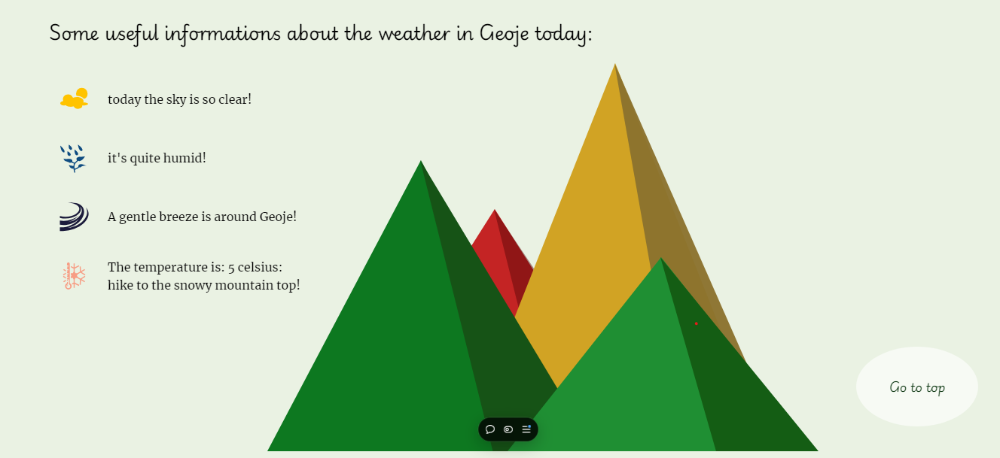

Read this file to gain all the informations about this project.

- project description;
- my skillset;
- how to install this project locally;

### Visit my website at [this link](https://geoje-tourism-app.vercel.app/). 

## Description for this project

This is a full-responsive website, made to encourage tourism in Geoje (the small arcipelago in the South Gyeongsan province, South Korea) by providing the best spots to visit in a very fast, efficient, and user-friendly way. and it's 100% ideated, designed and coded by me, in JavaScript, using the `React` Library.
It uses Open Graph protocol metatags which generates cards for social media, and Twitter cards as well.
SEO is optimized through `JSON-LD` structured data script, and robots metatags.

## Desktop and mobile are very different: I warmly reccommend you to check both versions.

In the desktop version, the user is presented with an interactive map and cards for each location.
The map has buttons for each location, which are connected with their location card, and vice-versa.
Also this projects makes full use of the `tabIndex` key for users who want to interact with the website without notepad nor mouse.
The card presents different icons based on which facilities can be found on each location. When the user clicks a card, it expands the content with more informations plus a short description.
In the Mobile version the user interacts with the map to get all the informations.

It is divided in three main sections: one for the mainland of Geoje, second one for its seaside, and one for the small islets around the main island.
It provides the potential user/tourist with useful information about many locations. Each location can be discovered by clicking icons in the main map for each section.
It also gives very important informations in real time, such as the current weather, the humidity, the speed of the wind, etc...
UI/UX principles have been taken into serious account, to provide informations in a fast, effective, and engaging way.

## This project shows:
-  my knowledge of JavaScript: events, search algorithms and callback functions;
-  my proficiency with the React library: many types of hooks like useContext, useRouter, useRef, useState and useEffect;
-  my understanding of UI-UX principles and CSS `@media` ruleset to create responsiveness;
-  my ability at creating simple but appealing animations with pure CSS;

All my contacts can be found in the footer section. The text animation in this section is achieved with a basic setInterval() plus an empty useState array wich fetches chars from a preset string.

## How to test this project on your pc:
- [clone] this Github repository on your pc, using the Terminal CMD or Bash, or Shell:
        git clone https://github.com/AdrianoGratani/Geoje-Tourism-App.git

- now you can access the project in your pc:
- install the [npm] packages via terminal:
        `npm install`

  and then:
        `npm start`
